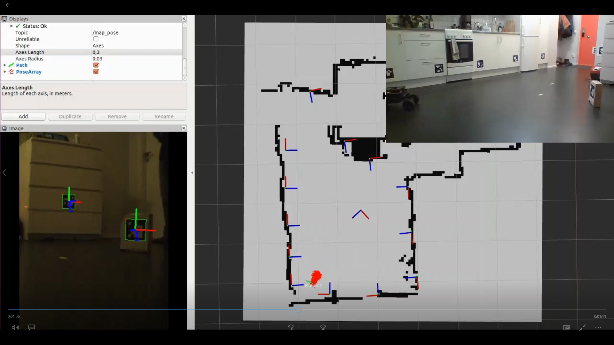
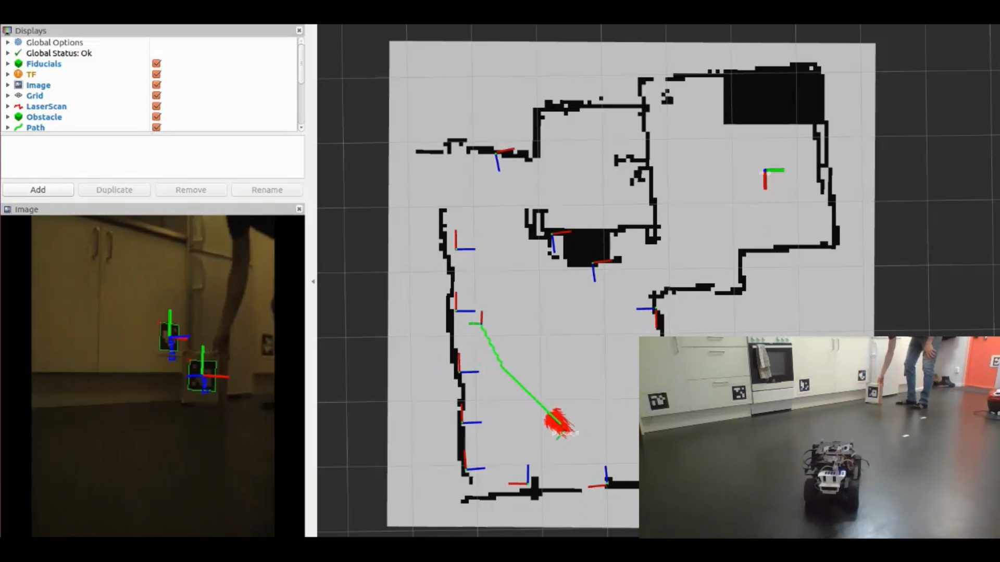

# Aruco Interface Examples

These scripts provide examples for interacting with the ArucoInterface and
ArucoSlamInterface classes found in
[svea.sensors](https://github.com/KTH-SML/svea_research/tree/master/src/svea/src/svea/sensors)
and
[svea.localizers](https://github.com/KTH-SML/svea_research/tree/master/src/svea/src/svea/localizers)
respectively. They are designed to interact with the results published by
[aruco_detect](http://wiki.ros.org/aruco_detect) and the maps built with
[fiducial_slam](http://wiki.ros.org/fiducial_slam). aruco_detect publishes the
relative transform between the camera and detected fiducial (aruco) markers as a
[fiducial_msgs/FiducialTransformArray](http://docs.ros.org/kinetic/api/fiducial_msgs/html/msg/FiducialTransformArray.html).
There is also an example script showing how a map can be initiated, as you should
start fiducial_slam with one known marker location.

The functions in the ArucoInterface and ArucoSlamInterface classes have been
designed to interact with Marker() objects. As such, most functions are called
with a Marker() object and the necessary feature of the marker (e.g. fid, pose,
etc.) is used in the function. A convenient way to interact with the functions
is to create a dictionary of Marker() objects, as seen in the example scripts.

These examples are not designed to detail the capabilities exhaustively, but
rather provide some basics and inspiration for how to start interacting
with ArUco (fiducial) markers with these classes.

### System Requirements
The system requirements detailed in the
[svea_research](https://github.com/KTH-SML/svea_research) README.md should
contain all required dependencies to use these examples, besides the
[fiducials](http://wiki.ros.org/fiducials) package.

### Basic Usage Instructions
1. Configure aruco_detect.launch
    - Set arg names to match camera name and transport methods
    - fiducial_len corresponds to the size of the markers
    - dictionary corresponds to the type of markers being used
    - See [aruco_detect](http://wiki.ros.org/aruco_detect) documentation for
      further details

2. Launch:
    - The camera stream
    - A static transform from the camera to the base_link
    - aruco_detect.launch

**Note:** aruco_detect requires camera intrinsics are published as a [CameraInfo
Message](http://docs.ros.org/api/sensor_msgs/html/msg/CameraInfo.html). If your
camera node does not publish the intrinsics, add a node to do so (i.e.
yaml_to_camera_info_publisher.py)

### Example Images
1. Estimating the vehicle's position based on a known marker location,
while simultaneously estimating the unknown pose of another marker.

1. Estimating a vehicle's position based on a known marker location,
while simultaneously determining a pose offset from and facing the movable marker.
The estimated vehicle pose and offset pose are used as the start pose and goal pose,
respectively, for A* path planning.

### Additional Information
The ArucoSlamInterface is in development towards being a replacement for
[fiducial_slam](http://wiki.ros.org/fiducial_slam), but it is not there yet. A
lot of the functionality is there, but it cannot yet replace it. If you want to
build a map using SLAM, fiducial_slam is still recommended.

Recommended website for printing ArUco markers: https://chev.me/arucogen/

Use the 5x5 markers, which correspond to dictionary 7 in aruco_detect.launch

**To Do:** Here is a list of functionality that is still needed:
- Account for different marker dimensions()
    - If a specific marker dim doesn't match the value in aruco_detect.launch
      then measurements must be adjusted
- aruco_map_init.py converted to a function in ArucoSlamInterface
- Confirm there are no issues when upgrading to ROS Melodic
    - Interfaces & examples were developed using ROS Kinetic
- Build out full functionality of ArucoSlamInterface to replace fiducial_slam
    - Can convert to .json map file format once we are not dependent upon
      fiducial_slam
- Other to do's ...